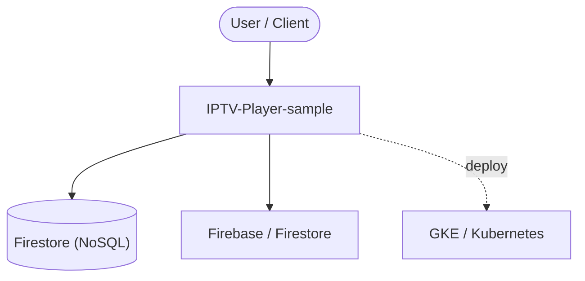

# Context Map — `IPTV-Player-sample`

> Auto-generated architecture & deployment context map. Summarizes the core application, container/cloud footprint, and database connections. Regenerate after significant structural changes.

**Repo:** `avnit/IPTV-Player-sample` · **Fork** · Public · Primary language: JavaScript · Default branch: `master` · Files: 273

**Description:** 📺 Watch 8000+ publicly available IPTV channels within your browser

## 1. Core application

## 2. Containers & cloud applications

**Detected cloud platforms / services:** GKE / Kubernetes, Firebase / Firestore

## 3. Database connections

**Datastores in use:** Firestore (NoSQL)

**Referenced in:**
- `main.dart.js`

## 4. Architecture diagram

## 5. Security posture

- **Static scan findings:** 1 critical, 1 high

| Severity | Rule | File:Line |
|---|---|---|
| critical | gcp-api-key | `index.html:41` |
| high | generic-secret-assign | `index.html:41` |

---
_Generated by repo context-mapping pass on 2026-08-13._